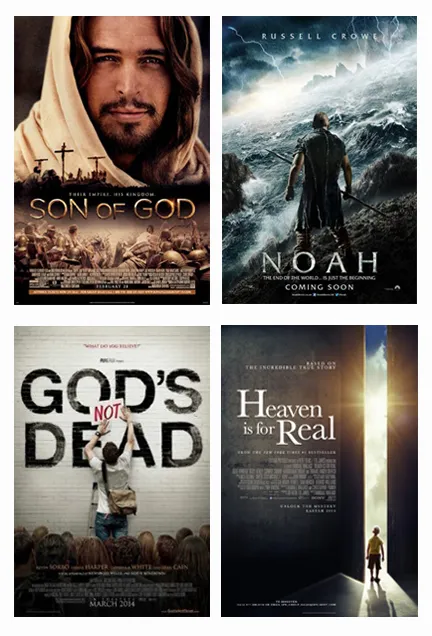

# Global Christian Movies & Documentaries for Kodi
**One addon. The whole world. One faith.**

Watch powerful Christian movies and documentaries from **Nigeria • Ghana • Kenya • South Africa • USA • UK • India • Brazil • Philippines • Korea • China** and more — all free from YouTube.

## Download & Install (30 seconds)

**Latest Version (v1.0.0 – 2025)**  
[Download plugin.video.global_christian_movies-1.0.0.zip](https://github.com/Debe2025/plugin.video.global_christian_movies/releases/download/v1.0.0/plugin.video.global_christian_movies-1.0.0.zip)

1. Open Kodi  
2. Add-ons → Open-box icon → **Install from ZIP file**  
3. Select the downloaded ZIP  
4. Wait → “Add-on installed”

Find it under **Video Add-ons → Global Christian Movies**

## How to Get Your FREE YouTube API Key (2 minutes)

1. Visit → https://console.cloud.google.com/apis/credentials  
2. Create Project → **+ CREATE CREDENTIALS** → **API key**  
3. Copy the key  
4. In Kodi: Open the addon → Settings → Paste into **YouTube Data API v3 Key** → OK

That’s it — worldwide Christian cinema unlocked!

## Countries Included

- Nigeria (Mount Zion, Flaming Sword)  
- Ghana • Kenya • South Africa  
- USA (Pure Flix, Kendrick Brothers, The Chosen)  
- UK • India (Hindi/Tamil/Malayalam)  
- Brazil • Philippines • Korea  
- China (Mainland & House Church testimonies)  
- All Countries (mixed global content)

Every country includes **movies + documentaries + testimonies**

## Features

- 11 countries in one addon  
- Real-time search across the globe  
- Fresh 2025 releases + timeless classics  
- Automatic YouTube addon installation  
- Works everywhere: Firestick, Android, Windows, Linux

## Legal & Important

- No hosted content — only public, embeddable YouTube videos  
- Respect YouTube ToS and local copyright laws

## For The Great Commission

One addon to reach every nation with the Gospel through film.  
From Lagos to Seoul, from São Paulo to Shanghai — Jesus is preached.

**Debe2025 © 2025** – MIT License

---
Go therefore and make disciples of all nations… through cinema too!  
Be blessed!